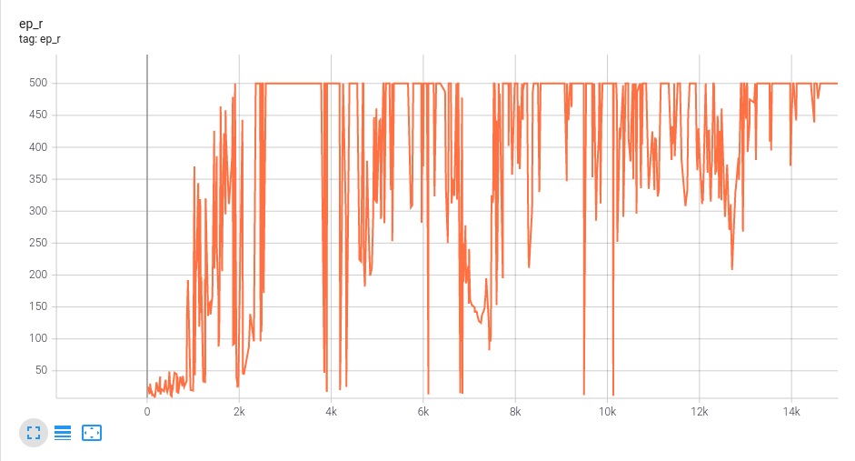
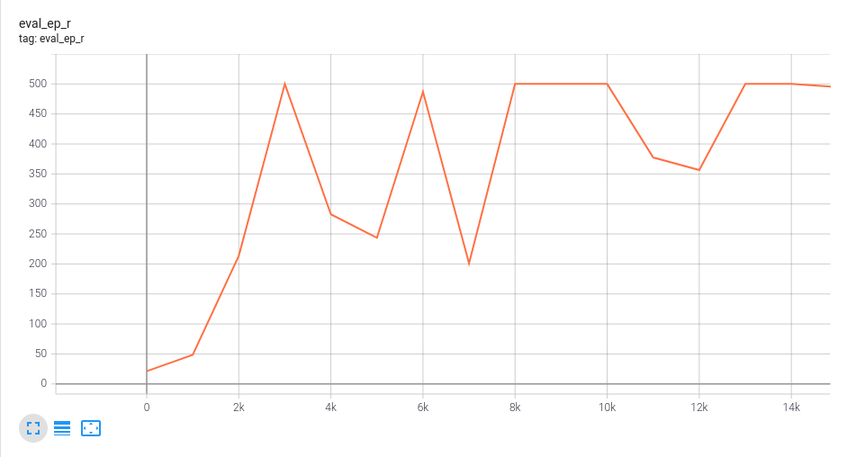

# Advantage Actor Critic

Advantage Actor Critic algorithm - single threaded version of A3C (Asynchronous Advantage Actor Critic) algorithm.

## References
* "Asynchronous Methods for Deep Reinforcement Learning", Mnih et al. [Link](https://arxiv.org/abs/1602.01783).

## Tested on
* [Cart Pole](https://gym.openai.com/envs/CartPole-v1/) - Move back and forth to balance a pole on a cart.

Cumulative Reward (total reward collected during episode) vs Episode, during training.

Evaluate agent performance every 1000 episodes. Each time calculate average cumulative reward over 100 episodes.

 

Trained agent

