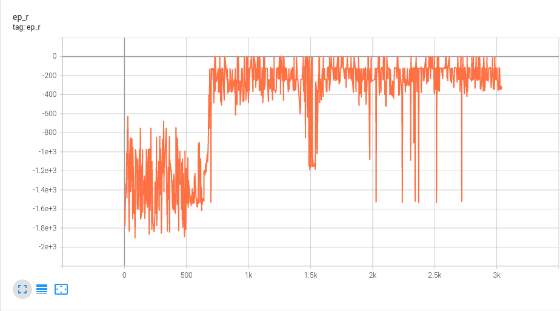
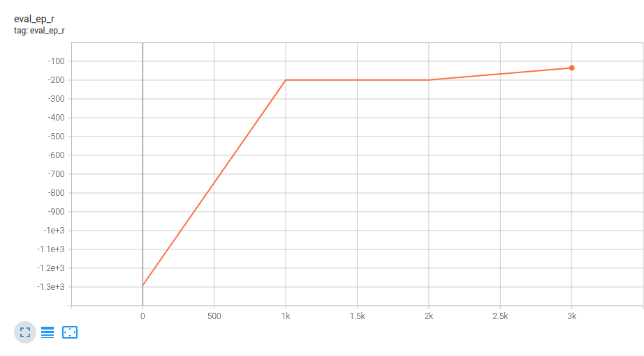
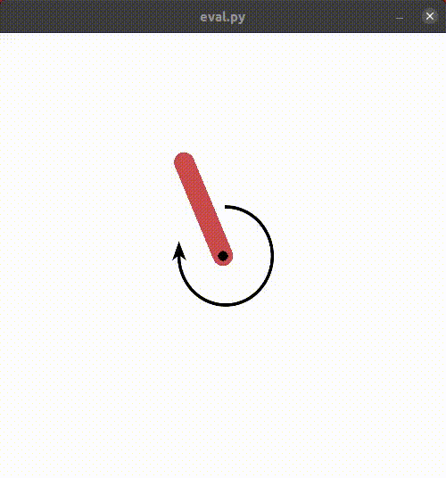
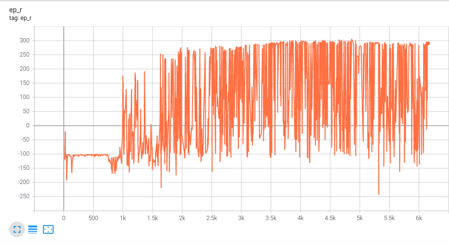
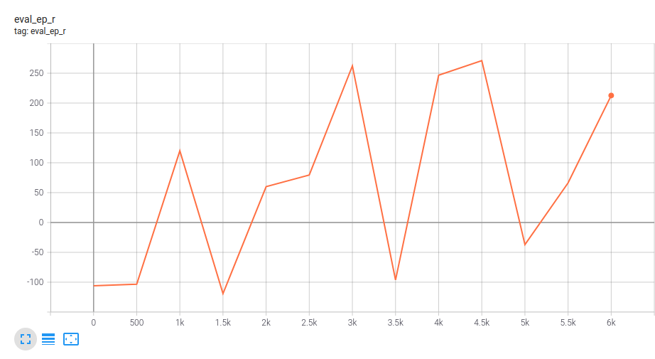

# DDPG

DDPG - Deep Deterministic Policy Gradient algorithm.

## References
* "Continuous control with deep reinforcement learning", Lillicrap et al. [Link](https://arxiv.org/abs/1509.02971).

## Tested on

* [Pendulum](https://gym.openai.com/envs/Pendulum-v0/) - Swing up a pendulum.

Cumulative Reward (total reward collected during episode) vs Episode, during training.

Evaluate agent performance every 1000 episodes during training. Each time calculate average cumulative reward over 100 episodes.

 

Trained agent

* [Bipedal Walker](https://gym.openai.com/envs/BipedalWalker-v2/) - Train a bipedal robot to walk.

Cumulative Reward (total reward collected during episode) vs Episode, during training.

Evaluate agent performance every 500 episodes during training. Each time calculate average cumulative reward over 100 episodes.

 

Trained agent

