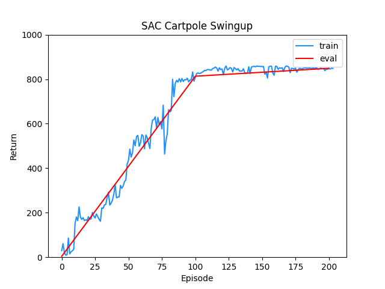
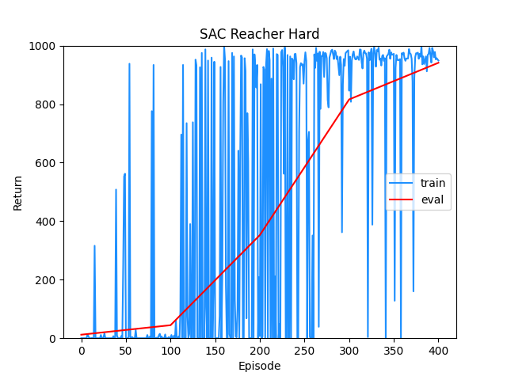
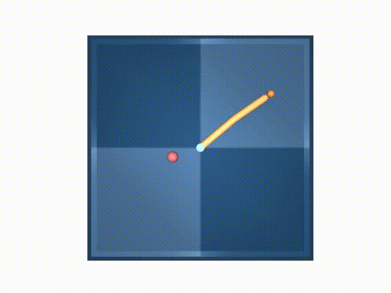
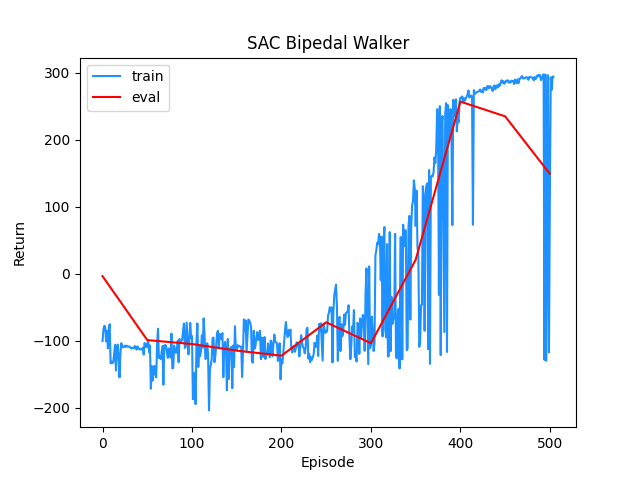
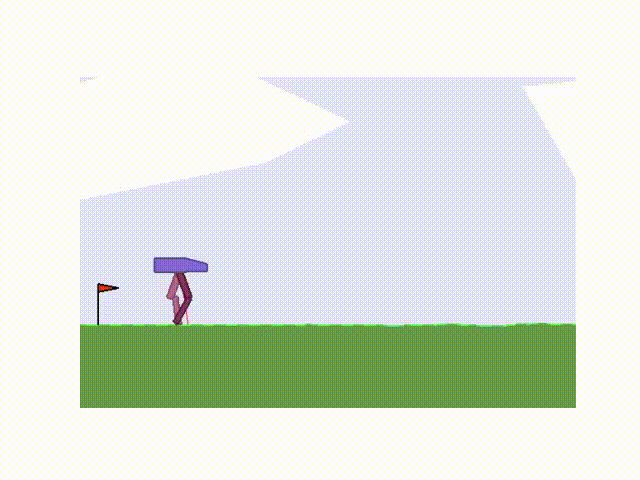

# SAC

SAC - Soft Actor Critic algorithm.

## References
* "Soft Actor-Critic: Off-Policy Maximum Entropy Deep Reinforcement Learning with a Stochastic Actor", Haarnoja et al. [Link](https://arxiv.org/abs/1801.01290).
* "Soft Actor-Critic Algorithms and Applications", Haarnoja et al. [Link](https://arxiv.org/abs/1812.05905).

## Tested on

* Cartpole Swingup (Deepmind Control Suite) - Move back and forth to swing up and balance a pole on a cart.

* Reacher Hard (Deepmind Control Suite) - Control a two-link robotic arm to reach a randomized target location.

* [Bipedal Walker](https://gym.openai.com/envs/BipedalWalker-v2/) (OpenAI Gym) - Train a bipedal robot to walk.

