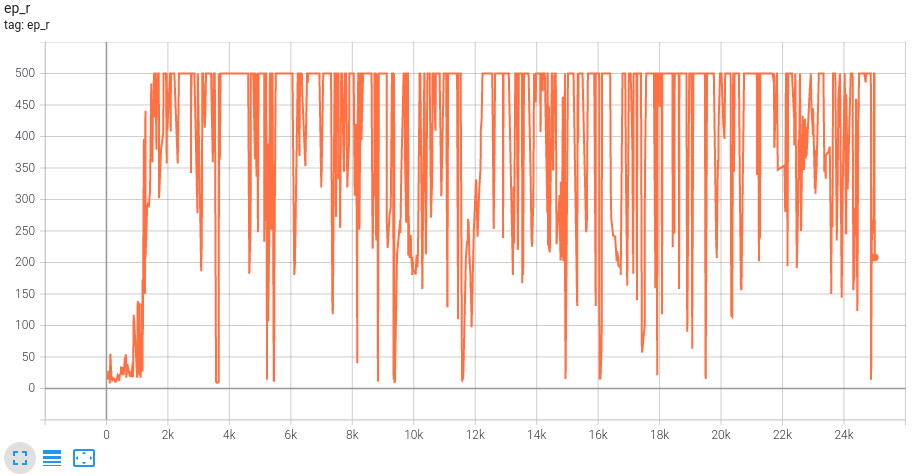
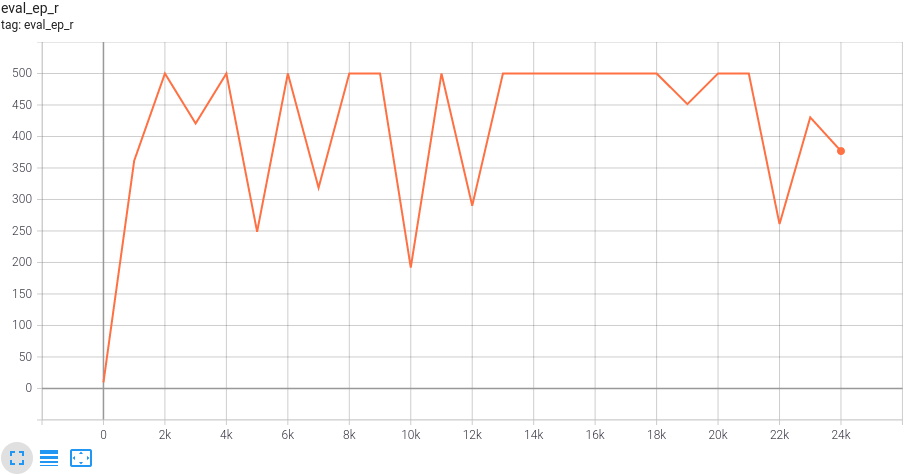
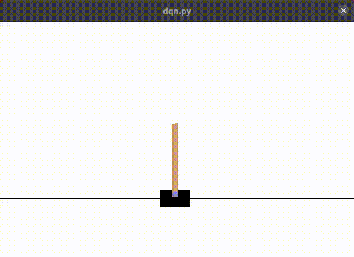
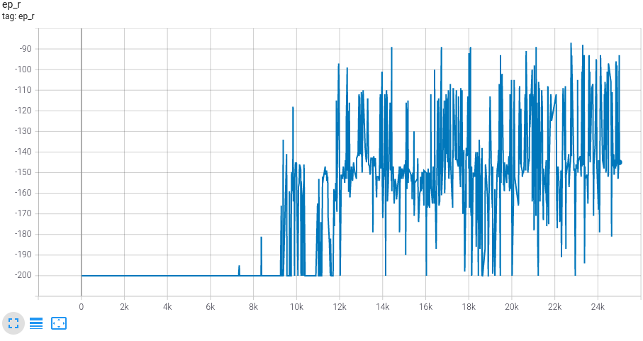
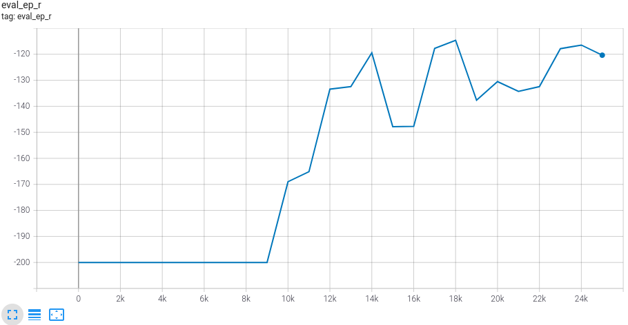
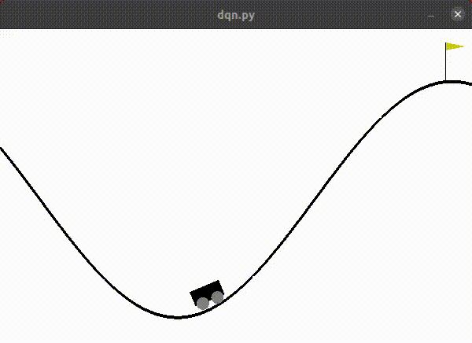

# DQN

DQN - Deep Q learning with experience replay, target networks.

## References
1) "Playing Atari with Deep Reinforcement Learning", Mnih et al. [Link](https://www.cs.toronto.edu/~vmnih/docs/dqn.pdf).
2) "Human-level control through deep reinforcement learning", Mnih et al. [Link](https://web.stanford.edu/class/psych209/Readings/MnihEtAlHassibis15NatureControlDeepRL.pdf).

## Results
1) [Cart Pole](https://gym.openai.com/envs/CartPole-v1/) - Move back and forth to balance a pole on a cart.

2) [Mountain Car ](https://gym.openai.com/envs/MountainCar-v0/) - Move back and forth to build up enough momentum to drive up a mountain.

Plot meanings :
* ep_r : Episodic return (total reward collected during episode) vs Episode number during training.
* eval_ep_r : Agent performance evaluated every 1000 episodes during training. Each time measure average episodic return over 100 episodes.

